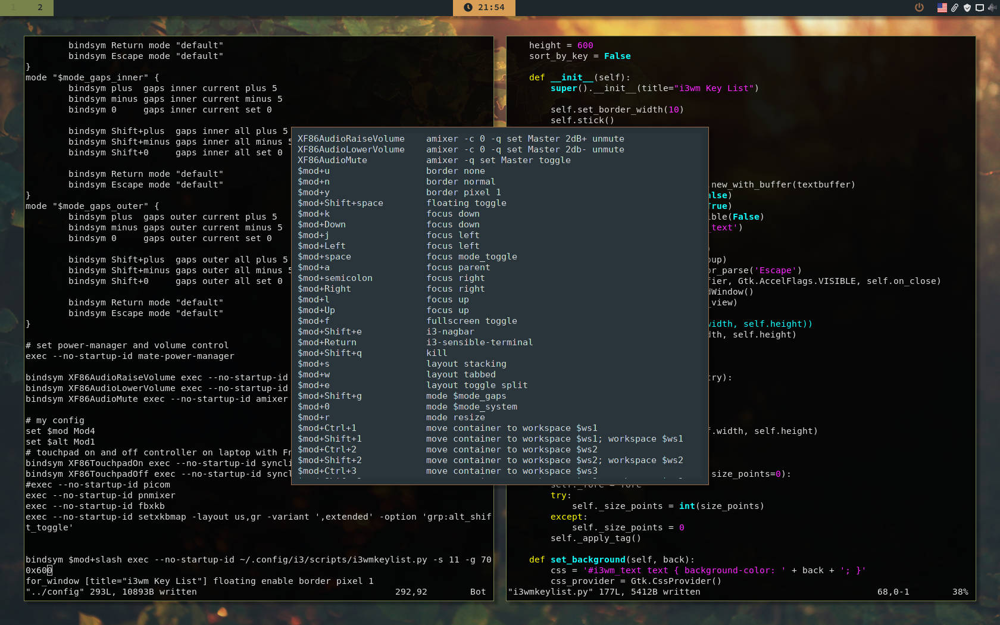

# i3-keylist

Display i3 Window Manager Key List

## Table of Contents

-   [Introduction](#introduction)
-   [1. Script i3-keylist-view.py](#1.-script-i3-keylist-view.py)
-   [2. Script i3-keylist.py](#2.-script-i3-keylist.py)
-   [3. Script i3-keylist.sh](#3.-script-i3-keylist.sh)

## Introduction

This project was inspired by a youtube video by
[DistroTube](https://www.youtube.com/channel/UCVls1GmFKf6WlTraIb_IaJg)
titled "[Want A List Of Your Keybindings? Write A Shell
Script!](https://www.youtube.com/watch?v=WkXyXIs-ZMI)".

The idea is to have a window displaying the key bindings used by i3,
much like the window [awsome window manager](https://awesomewm.org/)
has.

My first thought was to use BASH shell scripting and see where it get
me, but I finally ended up using **python** for it.

So, [PyGObject](https://pygobject.readthedocs.io/) was the way to go:
**i3-keylist.py** is the first product of this effort.

Then, after some more reading and playing around, I got the data
arranged into a ListView: **i3-keylist-view.py**.

Now, since [GTK](https://www.gtk.org/) is notorious for breaking its
theming with each and every release, a shell script (using
[YAD](https://github.com/v1cont/yad)) is also availabe:
**i3-keylist.sh**. This way, it's up to YAD to take care of GTK theme
breakages.

So, here you are: three scripts that are basically perform the same function. Just test them and use the one that suits you best.

Enjoy!

## 1. Script i3-keylist-view.py

This is the primary script of this project.

    $ i3-keylist-view.py -h
    usage: i3-keylist-view.py [-h] [-i INPUT_FILE] [-g GEOMETRY] [-f FORE]
                              [-b BACK] [-s SIZE] [-k] [--shell]

    i3 Key List Display Utility

    optional arguments:
      -h, --help            show this help message and exit
      -i INPUT_FILE, --input-file INPUT_FILE
                            read keys from this file instead of the default
      -g GEOMETRY, --geometry GEOMETRY
                            use this window size (default is 800x600)
      -f FORE, --fore FORE  set the foreground color
      -b BACK, --back BACK  set the background color
      -s SIZE, --size SIZE  set text size
      -k, --key             sort by key (default is by command)
      --shell               just print the list and exit

The sctipt can set the dimension of the window displayed, along with the
foreground and background color and size of the text rendered.

### Installation

Just copy the script to any location of your choosing (I will assume
that this location is **\~/.config/i3/scripts**).

Then, choose a **key binding** to use to execute the script (I will
assume **#mod+slash**, i.e. **Super+/**).

Please make sure **PyGObject** is already installed in your system.
Package name: **python-gobject** or **python3-gobject** or similar.

    cp i3-keylist-view.py ~/.config/i3/scripts
    echo 'bindsym $mod+slash exec --no-startup-id ~/.config/i3/scripts/i3-keylist-view.py' >> ~/.config/i3/config
    echo 'for_window [title="i3 Key List"] floating enable border pixel 1' >> ~/.config/i3/config

## 2. Script i3-keylist.py

This is the old primary script of this project, kept here just for
reference.

    $ i3-keylist.py -h
    usage: i3-keylist.py [-h] [-i INPUT_FILE] [-g GEOMETRY] [-f FORE] [-b BACK]
                         [-s SIZE] [-k] [--shell]

    i3 Key List Display Utility

    optional arguments:
      -h, --help            show this help message and exit
      -i INPUT_FILE, --input-file INPUT_FILE
                            read keys from this file instead of the default
      -g GEOMETRY, --geometry GEOMETRY
                            use this window size (default is 800x600)
      -f FORE, --fore FORE  set the foreground color
      -b BACK, --back BACK  set the background color
      -s SIZE, --size SIZE  set text size
      -k, --key             sort by key (default is by command)
      --shell               just print the list and exit

The sctipt can set the dimension of the window displayed, along with the
foreground and background color and size of the text rendered.

### Installation

Just copy the script to any location of your choosing (I will assume
that this location is **\~/.config/i3/scripts**).

Then, choose a **key binding** to use to execute the script (I will
assume **#mod+slash**, i.e. **Super+/**).

Please make sure **PyGObject** is already installed in your system.
Package name: **python-gobject** or **python3-gobject** or similar.

    cp i3-keylist.py ~/.config/i3/scripts
    echo 'bindsym $mod+slash exec --no-startup-id ~/.config/i3/scripts/i3-keylist.py' >> ~/.config/i3/config
    echo 'for_window [title="i3 Key List"] floating enable border pixel 1' >> ~/.config/i3/config

## 3. Script i3-keylist.sh

This is the alternative script of the project.

You should use this script in case the previous one stops working
(setting colors and/or text size fails).

Please meke sure [YAD](https://github.com/v1cont/yad) is already
installed in your system.

    $ i3-keylist.sh -h
    usage: i3-keylist.sh [-h] [-g GEOMETRY] [-f FORE] [-b BACK] [-k]

    i3 Key List Display Utility

    optional arguments:
      -h, --help            show this help message and exit
      -i INPUT_FILE, --input-file INPUT_FILE
                            read keys from this file instead of the default
      -g GEOMETRY, --geometry GEOMETRY
                            use this window size (default is 800x600)
      -f FORE, --fore FORE  set the foreground color
      -b BACK, --back BACK  set the background color
      -k, --key             sort by key (default is by command)

The sctipt can set the dimension of the window displayed, along with the
foreground and background color of the text (but not its size).

### Installation

Same thing here. Just copy the script to any location of your choosing
(I will again assume that this location is **\~/.config/i3/scripts**).

Then, choose a **key binding** to use to execute the script (I will
again assume **#mod+slash**, i.e. **Super+/**).

    cp i3-keylist.sh ~/.config/i3/scripts
    echo 'bindsym $mod+slash exec --no-startup-id ~/.config/i3/scripts/i3-keylist.sh >> ~/.config/i3/config
    echo 'for_window [title="i3 Key List"] floating enable border pixel 1' >> ~/.config/i3/config
